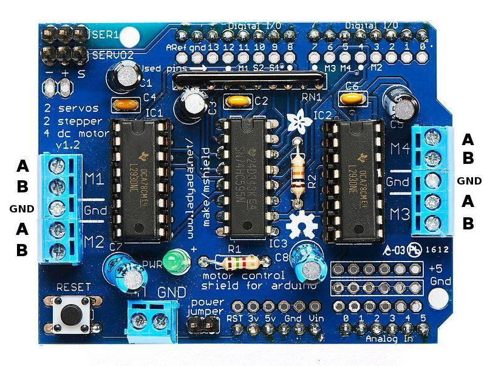

## 📌 Introduction

This project provides a C++ library (`TankShift`) for controlling a common L293D motor driver shield that uses a **74HC595 shift register**. By serializing motor commands, it allows an **ESP32-DevKitC V4** to drive two DC motors using only a few GPIO pins, making it ideal for robotics projects where pin economy is critical.

The main sketch (`tank.ino`) demonstrates how to use the library to receive commands from the serial terminal (e.g., WASD or arrow keys) and translate them into tank-like movements.

---

## ⚙️ Core Components

The control system is based on the interaction between the L293D motor driver and the 74HC595 shift register.

### 1. The L293D Motor Driver
The **L293D** is a dual H-bridge driver that allows two DC motors to move **forward**, **backward**, or **stop**. It works by controlling the polarity of the voltage supplied to each motor through two input pins (e.g., IN1, IN2). An enable pin (EN) also allows for PWM-based speed control, though on this shield, it is typically tied HIGH for full power.

### 2. The 74HC595 Shift Register
To save GPIO pins, the shield uses a **74HC595 shift register** to convert serial data from the ESP32 into parallel data for the L293D. Instead of needing 4+ pins for motor direction, you only need three:
- **SER (Serial Data)**: Sends one bit at a time.
- **SRCLK (Shift Clock)**: Pushes the bit into the register.
- **RCLK (Latch Clock)**: Transfers the 8 bits of data to the output pins (Q0-Q7).

### 3. How They Work Together
An 8-bit byte is sent from the ESP32 to the shift register. Each bit in this byte corresponds to an output pin on the 74HC595, which in turn is connected to a motor direction pin on the L293D.

The `TankShift` library abstracts this process. For example, to move forward, the library sends the byte `0b00000101`. Here’s how the bits are mapped:

| Bit | Register Output | L293D Pin | Motor       | Function        |
| --- | --------------- | --------- | ----------- | --------------- |
| 0   | Q0              | IN1       | Left Motor  | Direction bit 1 |
| 1   | Q1              | IN2       | Left Motor  | Direction bit 2 |
| 2   | Q2              | IN3       | Right Motor | Direction bit 1 |
| 3   | Q3              | IN4       | Right Motor | Direction bit 2 |
| 4–7 | Q4–Q7           | —         | —           | Unused          |

---

## Usage & Code Logic

The `TankShift` library provides a simple interface for controlling the motors.

### 1. Sending Data
The core function, `writeRegister(byte)`, sends 8 bits to the shift register. It iterates through the byte, setting the `SER` pin HIGH or LOW for each bit and "pulsing" the `SRCLK` pin to shift it in. Finally, it pulses `RCLK` to latch the data and update the motor directions.

### 2. Movement Commands
The library defines methods for common movements, each corresponding to a specific byte pattern sent to the register.

| Movement | Left Motor (IN1, IN2) | Right Motor (IN3, IN4) | Register Byte | `TankShift` Method |
| -------- | --------------------- | ---------------------- | ------------- | ------------------ |
| Stop     | `LOW`, `LOW`          | `LOW`, `LOW`           | `0b00000000`  | `.stop()`          |
| Forward  | `HIGH`, `LOW`         | `HIGH`, `LOW`          | `0b00000101`  | `.forward()`       |
| Backward | `LOW`, `HIGH`         | `LOW`, `HIGH`          | `0b00001010`  | `.backward()`      |
| Left     | `LOW`, `HIGH`         | `HIGH`, `LOW`          | `0b00000110`  | `.left()`          |
| Right    | `HIGH`, `LOW`         | `LOW`, `HIGH`          | `0b00001001`  | `.right()`         |

### 3. Serial Control
In the main `tank.ino` sketch, you can control the tank via the Arduino IDE's Serial Monitor:
- **W** or **Up Arrow**: Move forward.
- **S** or **Down Arrow**: Move backward.
- **A** or **Left Arrow**: Turn left.
- **D** or **Right Arrow**: Turn right.
- **Spacebar**: Stop.

---

## 🔌 Pinout & Connections

### Controller to 74HC595
| Shield Signal       | 74HC595 Pin | ESP32 Pin    | ESP32 GPIO | ESP8266 Pin (NodeMCU) | ESP8266 GPIO | Function                |
| ------------------- | ----------- | ------------ | ---------- | --------------------- | ------------ | ----------------------- |
| **SER**             | 14          | J3-6         | **GPIO21** | D1                    | **GPIO5**    | Serial data input       |
| **SRCLK**           | 11          | J3-8         | **GPIO19** | D2                    | **GPIO4**    | Shift clock             |
| **RCLK (Latch)**    | 12          | J3-2         | **GPIO23** | D5                    | **GPIO14**   | Latch clock             |
| **OE (active LOW)** | 13          | J3-9         | **GPIO18** | D6                    | **GPIO12**   | Output Enable (LOW)     |
| **VCC (Logic)**     | 16          | J2-19        | **5V**     | 5V / Vin              | **5V**       | Logic supply (5V)       |
| **GND**             | 8           | J2-14 / J3-1 | **GND**    | GND                   | **GND**      | Common ground           |

### Power & Motor Terminals
| Terminal           | Connect To             | Description                     |
| ------------------ | ---------------------- | ------------------------------- |
| **VMOT / +5V EXT** | 9–12 V external source | Motor power supply              |
| **5V (logic)**     | ESP32 5V pin           | Logic voltage for 74HC595/L293D |
| **GND**            | Shared                 | Common ground                   |
| **M1 (A/B)**       | Left Motor             | Controlled by Q0, Q1            |
| **M2 (A/B)**       | Right Motor            | Controlled by Q2, Q3            |

---

## ✅ Summary

This project demonstrates how to efficiently control an L293D motor shield with an ESP32 by using a 74HC595 shift register. The `TankShift` library encapsulates the low-level bit-shifting logic, providing a clean, high-level API for robot movement. This setup is a practical solution for building simple, cost-effective robots while conserving valuable GPIO pins.

