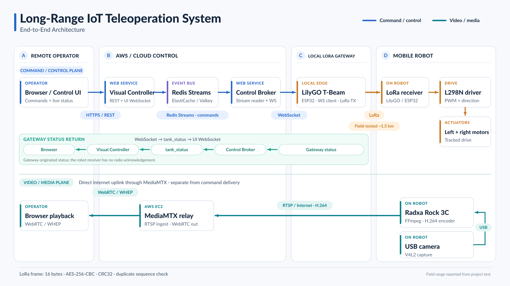

## Introduction

This project is an end-to-end teleoperation platform for a tracked robot. Browser commands pass through cloud services and Redis Streams, then a separate LilyGO T-Beam/ESP32 WebSocket-to-LoRa gateway sends encrypted control frames to the robot's ESP32 receiver and L298N motor driver. A Radxa Rock 3C sends H.264 camera video through an independent RTSP uplink to a MediaMTX relay on EC2; the browser uses WebRTC/WHEP playback. The LoRa control link was field-tested at approximately 1.5 km.

The Control Broker, Visual Controller, Stream Cleaner, and Telemetry Dashboard are deployed to AWS Elastic Beanstalk. Amazon ElastiCache/Valkey hosts the Redis-compatible event streams. GitHub Actions deploys the application services, while Terraform provisions the EC2 media relay infrastructure.

---

## System Architecture

**Command path:** Browser → Visual Controller REST API → Redis `tank_commands` → Control Broker → WebSocket → local LilyGO gateway → LoRa → robot ESP32 receiver → L298N → left/right motors.

**Status path:** The gateway reports its state over WebSocket → Control Broker → Redis `tank_status` → Visual Controller → browser UI WebSocket. The receiver does not send a LoRa acknowledgement.

**Video path:** USB camera → Radxa Rock 3C → FFmpeg/H.264 → RTSP over the Internet → MediaMTX on EC2 → WebRTC/WHEP browser playback. Video does not pass through the control broker or LoRa gateway.

The [end-to-end diagram](docs/architecture/rendered/system-architecture.svg) is the general project view. See the [AWS deployment diagram](docs/architecture/rendered/aws-deployment.svg), [command sequence](docs/architecture/command-sequence.mmd), and [architecture notes](docs/architecture/README.md) for deployment details, evidence, and regeneration steps. Optional radar/GPS/environmental telemetry uses a separate source and `tank_radar` stream.

---

## Features

### Hardware Control
- **Dual Motor Control**: Independent PWM speed regulation (0-255) per motor
- **Smooth Transitions**: Configurable ramping between speed changes
- **Tank-Style Movement**: Forward, backward, pivot left/right, gradual turns
- **TankShift Library**: C++ PWM ramping and tank-style movement on the ESP32 receiver
- **Optional Ultrasonic Radar**: Separate HC-SR04/SG90 source for environment scanning
- **Optional Sensor Feed**: Radar, GPS, and environmental data use a separate broker path

### Secure Communication
- **AES-256-CBC Encryption**: All LoRa commands encrypted end-to-end
- **CRC32 Validation**: Detects corrupted control frames
- **Sequence Tracking**: Suppresses duplicate sequence values at the receiver
- **Magic Header & Version Control**: Validates protocol compatibility
- **Redis TLS Support**: Cloud clients can use a `rediss://` connection

### LoRa Wireless Control
- **Long-Range Operation**: Field-tested at approximately 1.5 km
- **Low Latency**: Fast command execution for responsive control
- **Frequency Configuration**: Set the radio frequency for the deployed hardware and region
- **Adjustable Parameters**: Configurable spread factor, bandwidth, and transmit power

### Cloud Architecture
- **Microservices Design**: Decoupled Control Broker and Visual Controller services
- **Redis Streams**: Buffered command and status events between cloud services
- **WebSocket-to-LoRa Gateway**: Separate LilyGO T-Beam/ESP32 device connecting cloud control to radio
- **REST API**: Simple HTTP interface for command submission
- **Elastic Beanstalk Deployment**: Four application services deployed by GitHub Actions
- **AWS ElastiCache (Valkey)**: Managed Redis-compatible event backbone

### 🔧 Shared Protocol Library
The `ControlProtocol.h` header provides a standardized communication framework:
- **Shared Firmware Protocol**: Used by the current ESP32 gateway and receiver builds
- **Compact Frame Format**: 16-byte encrypted packets minimize bandwidth
- **Command Set**: Stop, Forward, Backward, Left, Right, SetSpeed
- **Frame Validation**: Version, magic value, and CRC32 in the shared header; the receiver also suppresses duplicate sequences

---

## Core Components

### L298N Dual H-Bridge

The **L298N** exposes two identical H bridges. Each side needs:

- `IN1` / `IN2` / `IN3` / `IN4`  to choose direction
- `ENx` to gate power (HIGH = run, LOW = stop) (can be PWM modulated for speed control)

The helper class toggles those pins directly and drives the enable lines with PWM, ramping between targets so direction changes feel smooth.

### LoRa Transceiver Module
The current gateway and receiver builds use the LilyGO T-Beam's integrated LoRa radio. Configure frequency, spread factor, bandwidth, and transmit power for the deployed radio hardware and region in both firmware builds.

---

### Encryption Details
- **Algorithm**: AES-256 in CBC mode
- **Key Size**: 256-bit (32 bytes)
- **IV Size**: 128-bit (16 bytes)
- **Block Size**: 16 bytes (matches frame size)

---

## Pinout & Connections

### Motor Controller (Receiver)

| Signal | L298N pin | Robot ESP32 GPIO |
| --- | --- | --- |
| Left motor PWM | ENA | 25 |
| Left direction 1 | IN1 | 22 |
| Left direction 2 | IN2 | 21 |
| Right motor PWM | ENB | 14 |
| Right direction 1 | IN3 | 15 |
| Right direction 2 | IN4 | 13 |

### LoRa Module Connections

The current gateway and receiver target LilyGO T-Beam ESP32 boards with integrated radio wiring. Board-specific radio pins are selected in `tx_websocket_gateway/utilities.h` and `rx_driver/utilities.h`; the generic ESP8266 pin map previously shown here does not describe these builds.

### Ultrasonic Radar Module Connections

The optional, separate ultrasonic radar source uses an HC-SR04 sensor mounted on an SG90 servo for scanning:

| Component | Pin  | ESP32 Default | ESP8266 Default | Notes                                          |
|-----------|------|---------------|-----------------|------------------------------------------------|
| HC-SR04   | VCC  | 5 V (VIN)     | 3V3\*           | Prefer a 5 V rail on ESP8266 if level shifted  |
| HC-SR04   | GND  | GND           | GND             | Common ground with MCU and servo               |
| HC-SR04   | Trig | GPIO 32       | D6              | Defined by `TRIG_PIN` constant                 |
| HC-SR04   | Echo | GPIO 33       | D7              | Add voltage divider when using ESP8266         |
| SG90      | VCC  | 5 V (external)| 5 V (external)  | Use dedicated supply; share ground             |
| SG90      | GND  | GND           | GND             | Tie grounds together                           |
| SG90      | PWM  | GPIO 13       | D5              | Defined by `SERVO_PIN` constant                |

**Note**: HC-SR04 ECHO outputs 5 V. Use a level shifter or resistor divider when interfacing with 3.3 V-only boards such as ESP8266.

Power the logic side with 5 V, feed the motor supply (7–12 V typical) to `VCC`/`VIN`, and keep grounds common between the driver and the MCU.

---

## Network Setup

### Robot Receiver (RX)

`rx_driver/rx_driver.ino` listens for LoRa control frames, validates/decrypts them, and drives the L298N through `TankShift`. It has a serial-control fallback; it does not connect to WiFi or the Control Broker.

### Local WebSocket-to-LoRa Gateway

`tx_websocket_gateway/tx_websocket_gateway.ino` connects to WiFi, opens a WebSocket client connection to the broker's `/ws/tank/{tank_id}` endpoint, converts command JSON to encrypted LoRa frames, and reports gateway state back over the same WebSocket. Configure its connection settings in `tx_websocket_gateway/config.h` without publishing network credentials.

### Control Broker Service
Cloud service deployed on AWS Elastic Beanstalk:
- Accepts gateway WebSocket connections on `/ws/tank/{tank_id}`
- Accepts radar sensor feeds on `/ws/radar/source/{source_id}` and rebroadcasts to `/ws/radar/listener`
- Subscribes to Redis `tank_commands` stream
- Routes commands to connected gateways
- Publishes gateway status to Redis `tank_status` stream
- Stores radar sweeps to Redis `tank_radar` stream for downstream consumers
- Health check endpoint at `/health`
- Environment variables: `REDIS_URL`, `REDIS_COMMAND_STREAM`, `REDIS_STATUS_STREAM`, `REDIS_STATUS_MAXLEN`, `REDIS_RADAR_STREAM`, `REDIS_RADAR_MAXLEN`

### Visual Controller Service
Web UI service deployed on AWS Elastic Beanstalk:
- Serves the controller and status pages (`/legacy`, `/nt`, `/joycon`, `/status` in the frontend router)
- REST API at `POST /command/{tank_id}` for command submission
- WebSocket endpoint at `/ws/ui/{tank_id}` for real-time gateway status
- Publishes commands to Redis `tank_commands` stream
- Subscribes to Redis `tank_status` stream
- Environment variables: `REDIS_URL`, `REDIS_COMMAND_STREAM`, `REDIS_STATUS_STREAM`

### Redis Event Backbone
The application uses an AWS ElastiCache/Valkey-compatible Redis endpoint for `tank_commands` and `tank_status`. The optional radar source uses `tank_radar`. Broker and Visual Controller code read with `XREAD`; the Stream Cleaner service trims configured streams. Redis TLS depends on the configured `REDIS_URL` scheme. This repository does not provision ElastiCache.

---

## Deployment

### Hardware Setup
1. Install required Arduino libraries via Library Manager
2. Configure matching control-frame secrets and LoRa parameters for both ESP32 devices
3. Flash `rx_driver/rx_driver.ino` to the robot's LilyGO T-Beam/ESP32
4. Configure WiFi and broker settings for `tx_websocket_gateway/tx_websocket_gateway.ino`, then flash the separate gateway
5. Verify gateway WebSocket connection and LoRa command reception before driving the motors

### Cloud Services Setup
1. Provide a Redis-compatible Valkey endpoint and configure `REDIS_URL` for the cloud services
2. Use `.github/workflows/deploy.yaml`: pushes to `main` package and deploy the four Elastic Beanstalk services through S3
3. Use the workflow's manual dispatch to run Terraform for the EC2 MediaMTX relay infrastructure
4. Configure the Radxa streamer and browser WHEP endpoint for the relay, then verify command and video paths separately

---

## Dependencies

### Hardware (Arduino/PlatformIO)
- **Arduino LoRa library** by Sandeep Mistry
- **mbedTLS** in the ESP32 core for control-frame encryption
- **WiFi** and **ArduinoWebsockets** on the gateway
- **TankShift** motor control library (included)
- **ArduinoJson** for gateway command/status messages

### Cloud Services (Python)
- **FastAPI** - Async web framework
- **redis.asyncio** - Async Redis client
- **pydantic** - Data validation
- **uvicorn** - ASGI server
- **python-dotenv** - Environment configuration

---

## Getting Started

### Quick Start (Hardware)
1. Install Arduino dependencies
2. Configure matching LoRa protocol settings on gateway and receiver
3. Configure gateway WiFi and broker connection settings
4. Flash the separate receiver and gateway firmware builds to their ESP32 boards
5. Power up and verify the gateway WebSocket and receiver LoRa control path

### Quick Start (Cloud)
1. Configure the cloud services with an ElastiCache/Valkey-compatible `REDIS_URL`
2. Deploy the four application services with the GitHub Actions workflow
3. Provision the EC2 media relay with the workflow's manual Terraform job
4. Access the Visual Controller and test command, gateway status, and video paths
